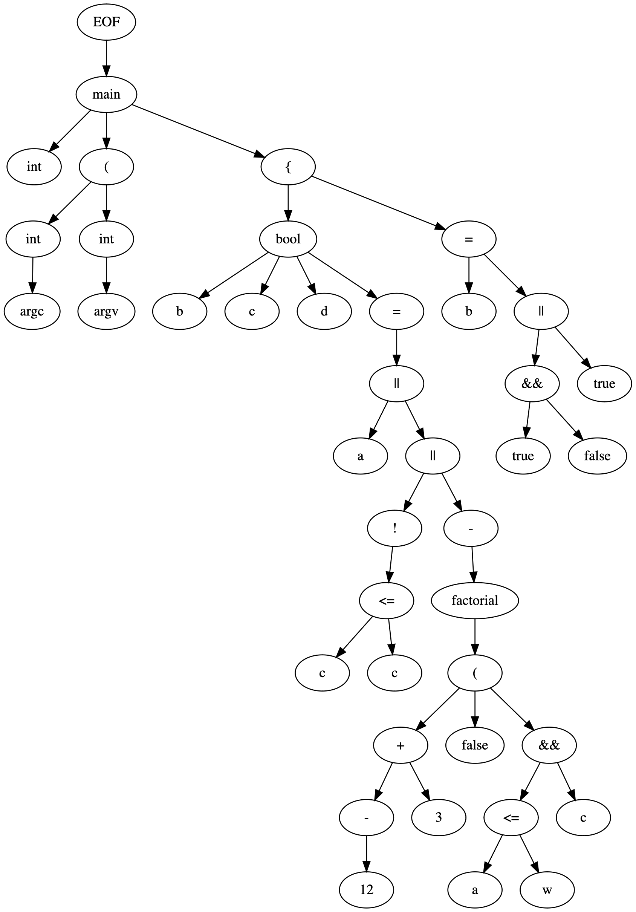

# lookahead parser

****
Simple lookahead parser for a c-type language in Java

Implementation of a lookahead parser plus lexer in Java for a c-type language. The parser looks ahead by one token. It generates an abstract syntax tree (AST) in the the dot graph representation language https://en.wikipedia.org/wiki/DOT_(graph_description_language). The main function is in parser.Parser.java

The output to the following program
```
int main(int argc,int argv){
    bool b,c,d = a || !(c<=c) || -factorial(-12+3,false,a<=w&&c);
    b = true && false || true;
}
```
is displayed below (each node corresponds to a token)



